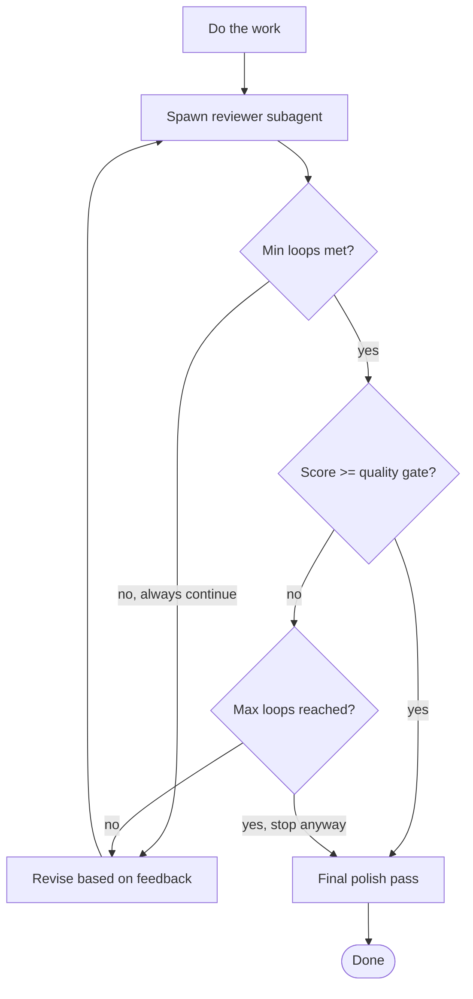

# Review Loop

Iterative worker-reviewer cycle within a single session. You do the work, spawn a reviewer subagent to critique it, revise based on feedback, repeat until quality gate is met.

**Core principle:** First drafts are never final. Iterative critique produces better output than a single pass.

> **Platform note:** This skill works best with agents that support subagent spawning.
> On platforms without that capability, simulate the reviewer step by opening a fresh
> chat context, pasting only the work product (no prior reasoning), and asking it to
> score 1-10 with specific feedback.

## Quick Start

1. Say: `"implement X, use review-loop"` or `"run review-loop on the file I just wrote"`
2. The agent does the work (or reads existing work)
3. A separate critic subagent scores it 1-10 with specific feedback
4. The agent revises and repeats until score >= 8 (default quality gate)
5. A loop summary is delivered with the final output

---

## When to Use

- User says "use review-loop", "polish this", "iterate on this", "/review-loop"
- Complex implementations where quality matters more than speed
- Design docs, specs, or technical writing
- Code that needs to be robust (security, data pipelines, financial logic)
- When user wants adversarial critique baked into the process

## When NOT to Use

- Simple fixes, quick edits, one-liner changes
- Tasks where tests are the quality gate (use TDD + CI instead)
- When the user just wants it done fast
- Exploratory/spike work where the goal is learning, not shipping
- Tasks with no clear acceptance criteria — define those first, then use review-loop

---

## Defaults

| Setting | Default |
|---------|---------|
| Min loops | 2 |
| Max loops | 4 |
| Quality gate | 8/10 |
| Worker model | (your current model) |
| Reviewer model | (your current model or fast/balanced alternative) |

Reviewers should ALWAYS run in subagents.

---

## Model Selection

The reviewer task evaluates logic and constraints. The worker task writes and modifies code. Pick subagent capabilities accordingly.

**CRITICAL RULE:** The Reviewer must always be EQUAL TO or MORE POWERFUL than the Worker. If the reviewer is weaker than the worker, it cannot properly critique complex logic or catch subtle regressions.

| Task Complexity | Worker Capability | Reviewer Capability | Rationale |
|----------------|--------|----------|-----------|
| Simple/mechanical (CRUD, formatting, boilerplate) | Fast / Lightweight | Balanced | Lightweight worker is fast, balanced reviewer easily catches issues |
| Standard (features, refactors, docs) | Balanced | Balanced | Good mix of cost, speed, and quality |
| Complex (multi-file, integration, design) | Balanced | Advanced / Reasoning | Advanced reviewer catches subtle architecture issues, balanced worker can implement them |
| Very complex (security, quant, distributed systems) | Advanced / Reasoning | Advanced / Reasoning | Both need full context and reasoning power. Reviewer MUST match worker power. |

**The golden rule:** The worker must be smart enough to ACT on the reviewer's feedback. If the reviewer says "fix the race condition with a channel-based semaphore" and the worker can't reason about concurrency, the loop won't converge.

**Escalation signal:** If score doesn't improve after 2 consecutive loops with the same feedback, the worker model is too weak. Escalate:
- Option A: Ask the user to switch to a more capable model
- Option B: Lower the quality gate temporarily and note the gap to the user
- Option C: Break the task into smaller sub-tasks and run review-loop on each

**Default behavior:** Since you (the main agent) ARE the worker, spawn a reviewer subagent that matches or exceeds your current capability based on the task:
- Most tasks → Standard/Balanced reviewer
- Specialized/hard tasks → Advanced/Reasoning reviewer
- Quick checks → Fast/Lightweight reviewer (only if you are also acting as a lightweight worker)

---

## User Overrides

Users can override any default inline with their request. Parse these naturally:

```
"implement X with review-loop, quality gate 9, use advanced model for review, max 5 loops"
"polish this, 2 loops minimum, gate at 8"
"run review-loop with fast reviewer, max 2 loops"
"use review-loop, reasoning reviewer, quality gate 9, min 3 max 6"
```

**Parsing rules:**
- "quality gate N" or "gate N" → quality_gate = N
- "[model] reviewer" or "review with [model]" → reviewer model override
- "max N loops" → max_loops = N
- "min N loops" → min_loops = N
- If user doesn't specify, use defaults
- If user says "thorough" or "strict" → interpret as quality_gate 8, min_loops 2
- If user says "quick" or "fast" → interpret as max_loops 2, quality_gate 6

---

## The Process



---

## Step-by-Step

### Step 1: Do the Work

Complete the task as you normally would. Write the code, create the spec, implement the feature. Don't hold back — produce your best first attempt.

### Step 2: Spawn Reviewer Subagent

Use the Agent tool to dispatch a reviewer. The reviewer must:
- Be a **separate subagent** (fresh context, no anchoring to your reasoning)
- Receive only the **work product** (files, diffs) — not your thought process
- Score 1-10 with **specific, actionable feedback**
- Use a balanced/standard model by default (or an advanced reasoning model for complex/specialized tasks)

**Reviewer prompt template:**

```
You are a critical reviewer. Score the following work 1-10 and provide specific, actionable feedback.

## What was done
{brief description of the task}

## Review criteria
{task-specific criteria — what matters for THIS task}

Examples of well-written criteria:
  For a REST API endpoint:
    - Correct HTTP status codes used
    - Input validation present on all parameters
    - Auth enforced; no unauthenticated access
    - No N+1 query patterns

  For a design doc:
    - Problem statement is unambiguous
    - Alternatives considered with trade-offs
    - No hand-waving on implementation complexity
    - Success metrics are measurable

  For a data pipeline:
    - Idempotent — safe to re-run
    - Schema changes handled gracefully
    - Failure modes documented
    - PII handling addressed

## Instructions
1. Read the work carefully
2. Score 1-10 where:
   - 1-3: Fundamentally broken or missing major requirements
   - 4-6: Works but has significant issues
   - 7-8: Good, minor issues only
   - 9-10: Excellent, ready to ship
3. List specific issues with file:line references where applicable
4. For each issue, explain WHY it matters and WHAT to fix
5. Do NOT be polite — be honest and direct
6. State your score clearly as "Score: N/10"

## Files to review
{paste file contents or list file paths with relevant excerpts}
```

### Step 3: Parse Feedback

From the reviewer response, extract:
- **Score** (the number)
- **Issues** (categorized as Critical / Important / Minor)
- **Specific fixes** (what to change)

Report to the user:
```
Loop {N}/{max}: Score {X}/10
- {summary of key feedback points}
```

### Step 4: Check Stop Conditions

In this order:
1. If loops completed < min_loops → **continue** (always)
2. If score >= quality_gate → **stop, go to final polish**
3. If loops completed >= max_loops → **stop, go to final polish**
4. Otherwise → **revise and loop**

### Step 5: Revise

Address the reviewer's feedback. Fix Critical and Important issues. Minor issues are optional. Then go back to Step 2.

**Important:** Each revision should be targeted. Don't rewrite everything — fix what the reviewer flagged. Maintain a mental list of ALL prior feedback to avoid regressions.

### Step 6: Final Polish

Once the loop exits (quality gate met or max loops hit):
- Address any remaining minor issues if trivial
- Verify the final output is coherent (no artifacts from revision cycles)
- Report final score and loop count to user

---

## Adapting Reviewer Criteria by Task Type

| Task Type | Reviewer Should Focus On |
|-----------|--------------------------|
| Code | Correctness, edge cases, error handling, readability, no security issues |
| Spec/Design | Completeness, feasibility, no hand-waving, implementability |
| Refactor | No behavior changes, no regressions, cleaner than before |
| Writing | Clarity, structure, audience-appropriate, no fluff |
| Bug fix | Root cause addressed, regression test exists, no side effects |
| Infrastructure / IaC | Idempotency, least privilege, no hardcoded secrets, destroy safety |
| Database migration | Reversibility, index strategy, data loss risk, performance at scale |
| API design | Backward compatibility, auth, versioning, error contract |
| Test suite | Edge case coverage, no test interdependency, meaningful assertions |

---

## Two Modes of Operation

### Mode A: "Do and Review" (full cycle)

User gives a task + says to use review-loop. You do the work AND run the review loop.

```
User: "Implement the caching layer. Use review-loop, quality gate 8."

You:
1. Implement caching layer
2. Spawn reviewer → Score 6, feedback: missing eviction, no TTL
3. Revise: add eviction + TTL
4. Spawn reviewer → Score 8, feedback: minor naming nit
5. Final polish, done
```

### Mode B: "Review Existing" (review only)

User already did work or you already did work. Just run the review loop on what exists.

```
User: "Run review-loop on the auth module I just wrote"

You:
1. Read the auth module
2. Spawn reviewer → Score 5, feedback: SQL injection, no rate limiting
3. Fix: parameterize queries, add rate limiter
4. Spawn reviewer → Score 8, approved
5. Done
```

---

## Red Flags

**Never:**
- Self-review instead of spawning a subagent (anchoring bias)
- Skip a revision cycle because "the feedback is wrong" without justification
- Inflate your own score ("I think this is actually a 9")
- Continue past max_loops without user consent
- Spawn the reviewer with your full reasoning/history (they must review the WORK, not your intent)

**If reviewer is wrong:**
- Push back with evidence (show code/tests that disprove the feedback)
- Skip that specific point in revision
- Note it in your report to the user
- Do NOT lower the quality bar to compensate

---

## Example Report Format

```
--- Review Loop: {task name} ---

Loop 1/4: Score 6/10
  Reviewer: Missing input validation, no error handling for network timeout,
            function too long (80 lines).
  Action: Fixing all three issues.

Loop 2/4: Score 8/10
  Reviewer: Clean. Minor: variable name `d` could be more descriptive.
  Action: Quality gate met (8 >= 8). Final polish.

Result: 8/10 in 2 loops. Done.
```

---

## Known Limitations

- The reviewer subagent has no memory of prior loops — include prior feedback context explicitly in each reviewer prompt to avoid repeating resolved issues
- Score inflation is possible if the reviewer prompt criteria are too vague — invest time in writing specific, measurable criteria
- This skill does not replace human code review for security-critical or compliance-sensitive code; treat the output as a strong first pass
- Loop convergence is not guaranteed if the task is underspecified — define clear acceptance criteria before starting

---

## Cost and Speed

- Each loop = 1 reviewer subagent call
- Budget roughly 1–2x the time of a single implementation pass for a full 3-loop cycle
- This is cheap compared to shipping buggy code, vague specs, or triggering a late-stage review cycle
- Use your default/standard model for most reviews; only upgrade to advanced reasoning models for specialized domains (security audits, distributed systems, quant finance)

---

## License

MIT — free to use, adapt, and redistribute with any AI tool or platform. Attribution appreciated. Contributions welcome.
